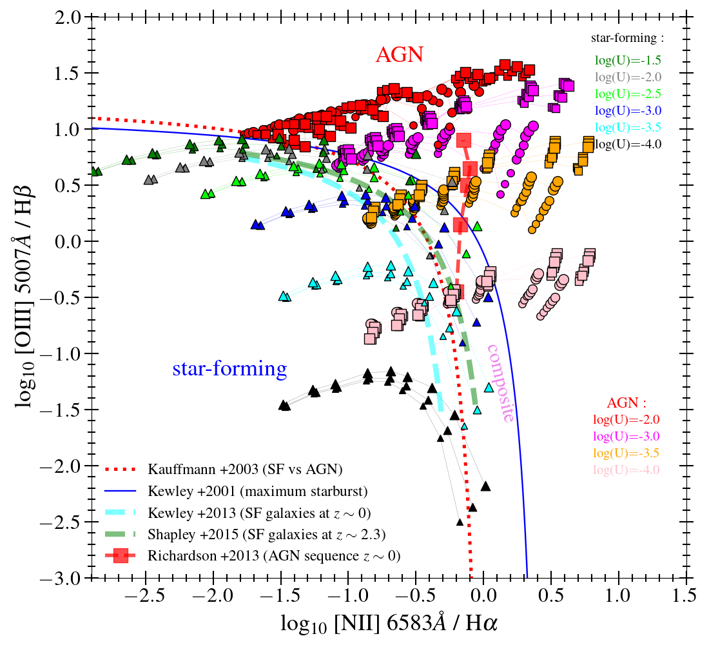

This repository contains the emission line fluxes predicted with the Cloudy photoionization code version 17.01 (Ferland et al. 2017) for the star-forming models described in Section 3.1 of Calabro et al. (2023):
https://arxiv.org/abs/2306.08605

We use for the calculations the package pyCloudy v.0.9.11: 
https://github.com/Morisset/pyCloudy/tree/0.9.11. 

$\textcolor{red}{**}$ **Update 10 February 2025 :** new models have been added, spanning a larger grid of electron densities as : $10^2$, $10^3$, $10^4$, $10^5$, and $10^6$ $cm^{-3}$. Predictions are also available for a few additional emission lines from the rest-frame UV to the far-infrared (see new tables: **new_predictions_AGN_models.txt** and **.csv**). The new predictions are made with the default AGN model only. $\textcolor{red}{*}$

# Description of the models 
## The default AGN model
The default ionizing source is created with the built-in ’AGN’ command in Cloudy, which produces a multiple power law continuum characterized by a ’blue bump’ temperature T<sub>bb</sub>, and spectral energy indices $\alpha$<sub>UV</sub>, $\alpha$<sub>ox</sub>, $\alpha$<sub>X</sub> in UV, optical to X-ray, and X-rays, respectively. T<sub>bb</sub>, $\alpha$<sub>UV</sub>, and $\alpha$<sub>X</sub> are set, respectively, to $10^6$ K, $-0.5$, and $-1.35$, as in Risaliti et al. (2000). $\alpha$<sub>ox</sub> is free to vary among the following values: $−2$, $−1.7$, $−1.4$, and $−1.2$. An example pyCloudy command appears as :

```js
AGN 6 -1.4 -0.5 -1.35
```

The brightness of the incident radiation field is defined through the ionization parameter log(U) varying between $−4$ and $−1$. 
Regarding the properties of the gas cloud surrounding the ionizing source (we adopt the spherical shell geometry), we assume a hydrogen number density ranging from $10^2$ to $10^4$ $cm^{−3}$, and a gas-phase metallicity Z<sub>gas</sub> from $33\%$ solar to three times solar, where the solar abundance of each element is set as in Savage \& Sembach (1996). The helium abundance is set slightly higher (by 0.1-0.2 dex) than for star-forming galaxies, following Dors et al. (2022). The Cloudy calculation is stopped when reaching a temperature of $500$ K. 
## The oxaf AGN models
The OXAF models are physically based AGN continuum emission models introduced by Thomas et al. (2016). They reproduce the diversity of observed AGN spectral shapes with only three main parameters:
- **E<sub>peak</sub>** : the energy at the peak of the accretion disk emission. 
- **$\Gamma$** : the power-law index of the non-thermal emission
- **p<sub>NT</sub>** : the fraction of the total flux coming from the non-thermal component 

In our simulations, E<sub>peak</sub> varies from 20 to 100 eV, following Fig. 5 of Thomas et al. (2016). For p<sub>NT</sub>, we assume three possible values: 0.1, 0.25, and 0.4. Finally, $\Gamma$ is set to +2.0.

A python code to convert and interpolate the AGN SED produced with the original oxaf code (https:// github.com/ADThomas-astro/oxaf) into a coarser grid ready to be injected as an input in Cloudy is included in the repository (*interpolate_convert_oxaf_models.py*). This new spectral shape is given to Cloudy through the command 'interpolate'. 


# Line predictions available
Each table contains the predictions of the line intensity (in units of *erg/s*, obtained with the command 'get_emis_vol' in pycloudy) of a specific emission line (scaled to $H\beta$ intensity $=100$) specified in the filename, as a function of the following model parameters : <br />

### for the standard AGN model (*joined_table_AGN_models.txt*) :
--- --- 
| column name | description |
| --- | --- |
| **alpha** | $\alpha$<sub>ox</sub> (spectral index of the AGN continuum from the optical to the X-ray regime) <br />
| **dens** | gas density of the cloud (in units of $1/cm^3$ and logarithmic scale) <br />
| **met** | gas-phase metallicity  <br />
| **OH** | corresponding oxygen abundance of the cloud (12+log(O/H)) <br />
| **logU** | ionization parameter <br />
--- ---

### for the oxaf AGN models (*joined_table_AGN_oxaf_models.txt*) :
--- --- 
| column name | description |
| --- | --- |
| **Epeak** | E<sub>peak</sub>, that is, the energy at the peak of the accretion disk emission <br />
| **pNT**  | p<sub>NT</sub>, that is, the fraction of the total flux coming from the non-thermal component <br />
| **gamma** | the power-law index of the non-thermal emission <br />
| **dens** | gas density of the cloud (in units of $1/cm^3$ and logarithmic scale) <br />
| **met** | gas-phase metallicity  <br />
| **OH** | corresponding oxygen abundance of the cloud (12+log(O/H)) <br />
| **logU** | ionization parameter <br />
--- ---

Currently, the flux predictions are available for the following emission lines, in order of increasing wavelength : 

| column name | emission line |
| --- | --- |
| CII_1335 | [CII] $1335$ &angst; |
| CIV_1551 | CIV $1550.78$ &angst; |
| HeII_1640 | HeII $1640.43$ &angst; |
| CIII_1909 | CIII] $1909$ &angst; |
| Hbeta | $H\beta$ |
| OIII_5007 | [OIII] $5006.84$ &angst; |
| Halpha | $H\alpha$ |
| NII_6583 | [NII] $6583.45$ &angst; |
| SIII_9531 | [SIII] $9530.62$ &angst; |
| CI_9850 | [CI]  $9850.26$ &angst; |
| HeI_10830 | HeI $10830$ &angst; |
| PaGamma | $Pa\gamma$ |
| PII_1188 | [PII] $11882.8$ &angst; |
| FeII_1257 | [FeII] $12566.8$ &angst; |
| PaBeta | $Pa\beta$ |
| FeII_132 | [FeII] $13205.5$ &angst; |
| FeII_164 | [FeII] $16435.5$ &angst; |
| PaAlpha | $Pa\alpha$ |
|    |


###
<hr><hr>

The following figure, shown as an example, represents the Cloudy predictions using the AGN models from Thomas et al. (2016).





*BPT diagram, where the line ratio predictions for AGNs are obtained using the recent models of Thomas et al. (2016,2018). For the AGN models with the same ionization parameter (colored as indicated in the legend), the circles are the predictions obtained with E<sub>peak</sub> = 20 eV, while the square symbols are derived assuming E<sub>peak</sub> = 100 eV. The marker size varies as a function of gas density (from $10^2$ to $10^4$ $cm^{−3}$ from the smaller to the larger). The three points with the same marker, size, and color, are the predictions of three different values of p<sub>NT</sub>: 0.1, 0.25, and 0.4. The star-forming models are also shown as described in the star-forming models repository:* https://github.com/Anthony96/star-forming_models.git
